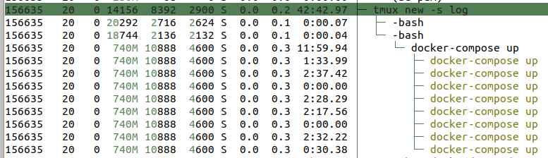

# microbetag back-end 


## Basic architecture and firing up

microbetag is hosted in KU Leuven server and is Docker oriented. 
More specifically, it consists of 3 Docker images:
- a database (`services/db/`)
- an ngninx (`services/nginx`)
- the actual app (`services/web`)
 
First, each of those images needs to be built. 
Assuming all 3 images are ready, all you have to do is to fire the `docker-compose` command. 
We will discuss how to edit an image later. 
When the `docker-compose` command performs, it will start the web-server of microbetag. 
That means we need a way that this will keep running even when we exit our terminal.
 
To this end, we init a tmux session:

```bash
tmux new -s dockerApp
```

From within the tmux session, we move to the root folder of this repo `/microbetagApp` and fire the `docker-compose` command:

```bash
docker-compose up
```


**Attention!**

You need to **detach** from the tmux session; **not** exit!
If you exit, the `docker-compose` command will be shut and your app will go down.
To detach, you need to press:
`ctrl+b` and then `d`.

You can attach to your running session any time by runnint
```bash
tmux attach -t dockerApp
```

When running `htop` now on the server and searching for "tmux" in the tree mode, you may see something similar with this:




The app is now up and running! 
You may check this by just typing to a browser: [msysbio.gbiomed.kuleuven.be/](msysbio.gbiomed.kuleuven.be/). 


## How to edit the app

As mentioned above, the app consists of 3 Docker images that all 3 of them are used simultaneously.
If one is to edit something on the app, they need to move to the corresponding 
image, edit the code and then **rebuild** the Docker image. 
For example, if you are about to edit a route of the `app.py` script, then you will have to rebuild the `microbetagapp-web` image:

```bash
docker build -f Dockerfile.prod -t microbetagapp-web:latest .
```

To make sure you can always come back to a working version of the app, a good pracice is to first make a backup **tag** of your working version
running

```bash
docker tag <docker_image_id> microbetagapp-web-working-version
```

and only then rebuild the Docker image. 


Once you have rebuild the image, all you need to do is to attach to the tmux session, create a new window (`ctrl + b` and then `c`) 
and fire again the `docker-compose up` command. 
This will re-create your `web` docker container and after a few seconds you app will be up and running once again with your new code. 

Remember to detach from the tmux session, not exit! 


## Notes on the server's environment


## Env

I made a new file under  `/etc/docker/` called `daemon.json`:

```bash
u0156635@gbw-s-msysbio01:/etc/docker$ more daemon.json 
{
  "data-root": "/data/docker"

}
```


### Ports 

I changed the mysql port of the vm to 4545 so I can have the 3306 for the container


### My database

We need to build the whole database in the vm or wherever (even on a laptop) and then export it to a `dbtest_data.sql` file. 
Here is how: 
```bash
 mysqldump -u [user name] –p [password] [database_name] > [dumpfilename.sql]

```

### To build the SSL keys 

Follow the instructions [here](https://www.baeldung.com/openssl-self-signed-cert)
and remove the pass phrase as shown [here](https://help.cloud66.com/docs/security/remove-passphrase).

> `openssl rsa -in [original.key] -out [new.key]`


## Links

- [Setting up and Running a MySQL Container](https://www.baeldung.com/ops/docker-mysql-container)
- [Creating a Self-Signed Certificate With OpenSS](https://www.baeldung.com/openssl-self-signed-cert)

Challenges:
- [`argparse` in nginx](https://github.com/benoitc/gunicorn/issues/1867)


## Notes after destroying `/data`


failed to update store for object type *libnetwork.endpointCnt: Key not found in store

this fixes by running 
sudo service docker restart


## VM overall

consider of crontabs removing for example /tmp folders


